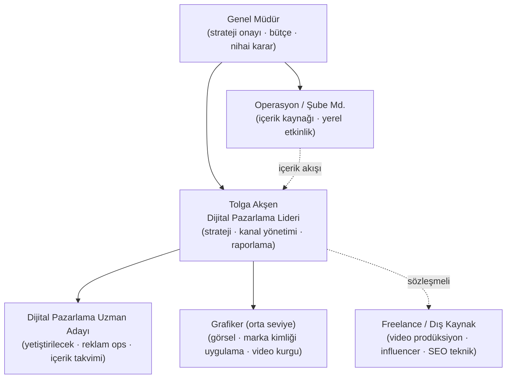
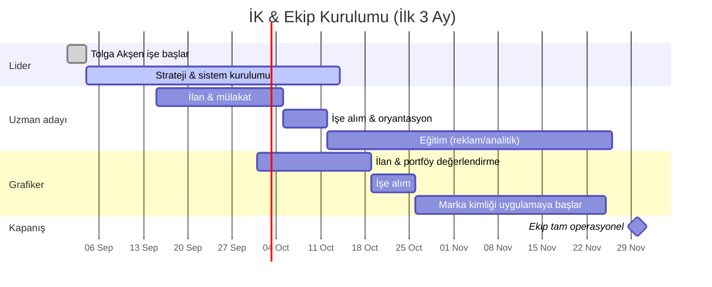
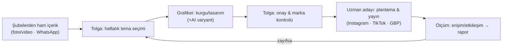
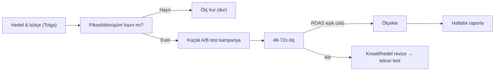
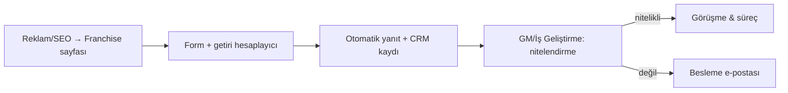

# 02 · Organizasyon Şeması · İK Planı · İş Akışları

> **Yazan:** Tolga Akşen · **Onay:** Genel Müdür · **Tarih:** 2026-08-04
> İlk ay **Tolga Akşen** Dijital Pazarlama Lideri olarak istihdam edilir; bu dokümandaki tüm stratejiler
> onun sorumluluğunda üretilmiş sayılır. Tolga **Genel Müdür'e** bağlıdır. İlk 3 ayda altında küçük bir ekip kurulur.

---

## 1. Organizasyon Şeması (hedef yapı — ilk 3 ay sonu)

**Raporlama hattı:** Genel Müdür → Tolga Akşen → (Uzman adayı + Grafiker). Operasyon/Şube müdürlüğü GM'ye
bağlıdır ama Tolga'ya **içerik ve yerel etkinlik** akışı sağlar (kesikli çizgi = işbirliği, yönetim değil).

### Roller ve sorumluluklar (RACI özeti)
| Görev | GM | Tolga | Uzman adayı | Grafiker |
|---|:--:|:--:|:--:|:--:|
| Strateji & bütçe onayı | **A** | R | I | I |
| Kanal stratejisi & optimizasyon | I | **A/R** | C | I |
| Reklam kurulumu & günlük ops | I | A | **R** | I |
| İçerik takvimi & yayın | I | A | **R** | C |
| Görsel/video & marka kimliği uygulaması | I | A | I | **R** |
| Raporlama (aylık) | **A** | **R** | C | I |
> A=Onaylayan, R=Yapan, C=Danışılan, I=Bilgilendirilen

---

## 2. İK Planı — ilk 3 ay (istihdam & yetiştirme)

**Kademeler:**
1. **Ay 1 (Eylül):** Tolga işe başlar → ölçüm altyapısı + strateji dokümanları + hızlı SEO düzeltmeleri.
   Uzman adayı ilanı açılır.
2. **Ay 2 (Ekim):** Uzman adayı işe alınır (reklam/analitik eğitimine girer); grafiker ilanı + işe alım.
3. **Ay 3 (Kasım):** Grafiker marka kimliği uygulamasına başlar; ekip tam operasyonel; roller netleşir.

**Yetiştirme (uzman adayı müfredatı — 45 gün):** GA4/GTM → Meta Business & Pixel → Google Ads → içerik/SEO →
raporlama. Her hafta bir kanal, sonunda küçük bir canlı kampanya ile sınama (test-önce).

---

## 3. İş Akışları (temel süreçler)

### 3.1 Haftalık içerik üretim akışı

### 3.2 Reklam kampanya akışı (test-önce)

### 3.3 Franchise adayı (lead) akışı

---

## 4. Karar Hakları (RAPID özeti)
- **R (Recommend):** Tolga — strateji ve kanal önerilerini hazırlar.
- **A (Agree):** GM — bütçe ve kırmızı çizgi uyumu.
- **P (Perform):** Uzman adayı + Grafiker — uygulama.
- **I (Input):** Operasyon/Şube — saha gerçeği, içerik.
- **D (Decide):** GM — nihai karar; Tolga tanımlı bütçe içinde operasyonel kararları verir.

Tek **Karar Günlüğü (Decision Log)** tutulur; her önemli karar + karşı görüş kaydedilir (silinemez).

---

*Önceki: [01 · Vizyon-Misyon-Değerler](01-vizyon-misyon-degerler.md) · Sonraki: [03 · Pazar Analizi →](03-pazar-analizi.md)*
