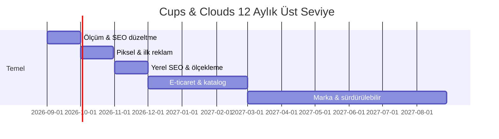

# 08 · Zaman Planı & Gantt

> Durum: iskelet — Gantt'lar Faz 2'de Mermaid + ECharts olarak

Kronoloji (yakın=detaylı, uzak=kaba): İlk 40 gün (gün-be-gün) → İlk 12 hafta (haftalık) → İlk 3 ay → İlk 6 ay → 2026 yıl sonu → 2026 çeyrekleri → 2027 çeyrekleri.

Örnek Gantt (Faz 1 – üst seviye):

